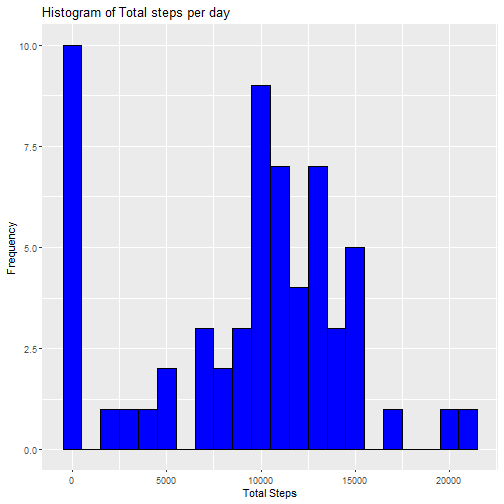
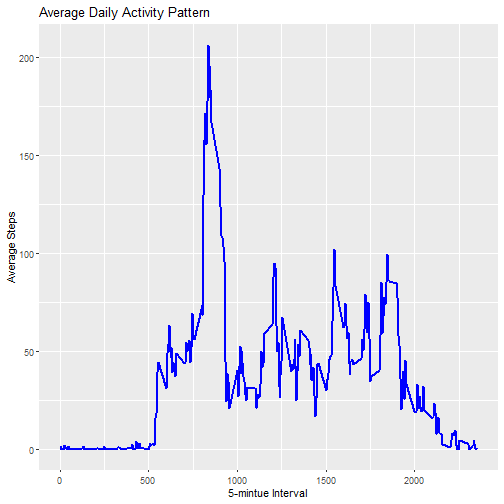
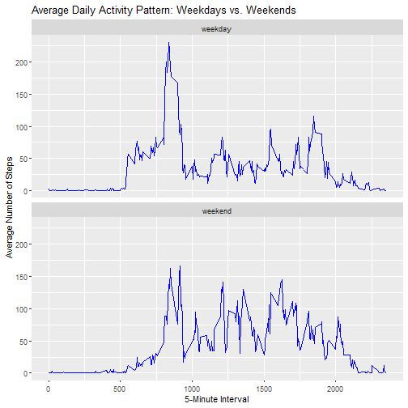

--
title : "Personal Activity Monitoring Anaysis"
Author: "Nathan Russell"
--
## Mean total steps taken per day

``` r
library(dplyr)
library(ggplot2)
#Load data
activity_data <- read.csv("activity.csv")
activity_data$date <- as.Date(activity_data$date, format="%Y-%m-%d")
str(activity_data)
```

```
## 'data.frame':	17568 obs. of  3 variables:
##  $ steps   : int  NA NA NA NA NA NA NA NA NA NA ...
##  $ date    : Date, format: "2012-10-01" ...
##  $ interval: int  0 5 10 15 20 25 30 35 40 45 ...
```

``` r
# Sum total steps per day
total_steps_per_day <- activity_data%>%
  group_by(date) %>%
  summarize(total_steps = sum(steps, na.rm = TRUE))
# Display first rows
head(total_steps_per_day)
```

```
## # A tibble: 6 × 2
##   date       total_steps
##   <date>           <int>
## 1 2012-10-01           0
## 2 2012-10-02         126
## 3 2012-10-03       11352
## 4 2012-10-04       12116
## 5 2012-10-05       13294
## 6 2012-10-06       15420
```

``` r
# plot histogram
ggplot(total_steps_per_day, aes(x = total_steps)) + 
  geom_histogram(binwidth = 1000, fill = "blue", color = "black") +
  labs(title = "Histogram of Total steps per day",
       x = "Total Steps",
       y = "Frequency")
```



``` r
#Calculate Mean and median
mean_steps <- mean(total_steps_per_day$total_steps, na.rm = TRUE)
median_steps <- median(total_steps_per_day$total_steps, na.rm = TRUE)
# display results 
mean_steps
```

```
## [1] 9354.23
```

``` r
median_steps
```

```
## [1] 10395
```

## Average Daily Activity Pattern

``` r
# find avg number of steps over 5 mintue interval
avg_steps_interval <- activity_data %>% 
  group_by(interval) %>%
  summarize(mean_steps = mean(steps, na.rm =TRUE)) #compute mean steps
  
head(avg_steps_interval)
```

```
## # A tibble: 6 × 2
##   interval mean_steps
##      <int>      <dbl>
## 1        0     1.72  
## 2        5     0.340 
## 3       10     0.132 
## 4       15     0.151 
## 5       20     0.0755
## 6       25     2.09
```

``` r
### Time Series plot 
ggplot(avg_steps_interval, aes(x = interval, y = mean_steps)) + 
  geom_line(color = "blue", linewidth = 1) +
  labs(title = "Average Daily Activity Pattern",
       x = "5-mintue Interval",
       y = "Average Steps")
```



``` r
## Max Interval 

max_interval <- avg_steps_interval %>%
  filter(mean_steps == max(mean_steps))
#display max interval
max_interval
```

```
## # A tibble: 1 × 2
##   interval mean_steps
##      <int>      <dbl>
## 1      835       206.
```

## Handling missing values


``` r
missing_values <- sum(is.na(activity_data$steps))
#display number of missing steps 
missing_values
```

```
## [1] 2304
```

``` r
# compute mean steps for each 5 min interval (ignore NA)
interval_means <- activity_data %>%
  group_by(interval) %>%
  summarize(mean_steps = mean(steps, na.rm = TRUE))

# Display the first few rows of the interval means
head(interval_means)
```

```
## # A tibble: 6 × 2
##   interval mean_steps
##      <int>      <dbl>
## 1        0     1.72  
## 2        5     0.340 
## 3       10     0.132 
## 4       15     0.151 
## 5       20     0.0755
## 6       25     2.09
```

``` r
#merge interval means w dataset
activity_imputed <- activity_data %>%
  left_join(interval_means, by = "interval")
#replace NA values in steps columnn with mean for interval
activity_imputed <- activity_imputed %>%
  mutate(steps = ifelse(is.na(steps), mean_steps, steps)) %>%
  select(-mean_steps)
#count missing values after imputation
sum(is.na(activity_imputed$steps))
```

```
## [1] 0
```

``` r
head(activity_imputed)
```

```
##       steps       date interval
## 1 1.7169811 2012-10-01        0
## 2 0.3396226 2012-10-01        5
## 3 0.1320755 2012-10-01       10
## 4 0.1509434 2012-10-01       15
## 5 0.0754717 2012-10-01       20
## 6 2.0943396 2012-10-01       25
```

### Activity pattern differences between weekdays and weekends

``` r
activity_imputed$date <- as.Date(activity_imputed$date)
# create factor variable for weekday vs weekend
activity_imputed <- activity_imputed %>% 
  mutate(day_type = ifelse(weekdays(date) %in% c("Saturday", "Sunday"), "weekend", "weekday"))
#convert to factor variable
activity_imputed$day_type <- factor(activity_imputed$day_type, levels = c("weekday", "weekend"))
head(activity_imputed)
```

```
##       steps       date interval day_type
## 1 1.7169811 2012-10-01        0  weekday
## 2 0.3396226 2012-10-01        5  weekday
## 3 0.1320755 2012-10-01       10  weekday
## 4 0.1509434 2012-10-01       15  weekday
## 5 0.0754717 2012-10-01       20  weekday
## 6 2.0943396 2012-10-01       25  weekday
```

``` r
#head confirms appropriate classification
#compute avg number of steps for interval, separated by weekday/weekend
avg_steps_weekday_weekend <- activity_imputed %>%
  group_by(interval, day_type) %>%
  summarize(mean_steps = mean(steps, na.rm = TRUE))
```

```
## `summarise()` has grouped output by 'interval'. You
## can override using the `.groups` argument.
```

``` r
#display first rows
head(avg_steps_weekday_weekend)
```

```
## # A tibble: 6 × 3
## # Groups:   interval [3]
##   interval day_type mean_steps
##      <int> <fct>         <dbl>
## 1        0 weekday      2.25  
## 2        0 weekend      0.215 
## 3        5 weekday      0.445 
## 4        5 weekend      0.0425
## 5       10 weekday      0.173 
## 6       10 weekend      0.0165
```

``` r
#create panel plot
ggplot(avg_steps_weekday_weekend, aes(x = interval, y = mean_steps)) +
  geom_line(color = "blue") +
  facet_wrap(~day_type, nrow = 2) +
  labs(title = "Average Daily Activity Pattern: Weekdays vs. Weekends",
       x = "5-Minute Interval",
       y = "Average Number of Steps")
```




